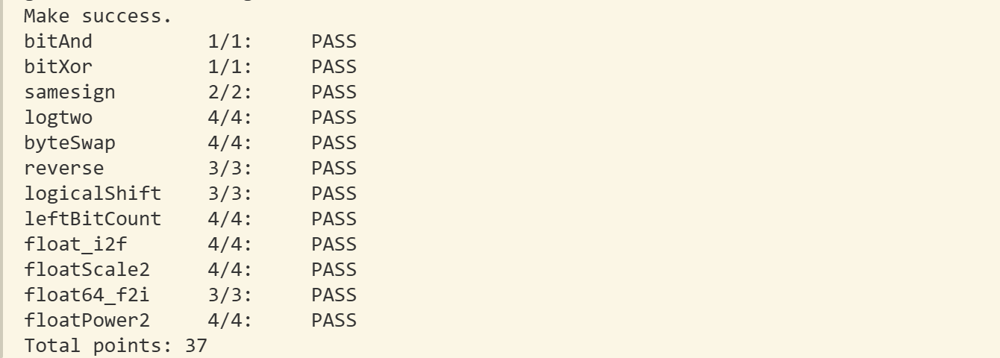

# datalab 报告

姓名：龙琦文

学号：2025201751

| 总分 | bitAnd | bitXor | samesign | logtwo | byteSwap | reverse | logicalShift | leftBitCount | float_i2f | floatScale2 | float64_f2i | floatPower2 |
| ---- | ------ | ------ | -------- | ------ | -------- | ------- | ------------ | ------------ | --------- | ----------- | ----------- | ----------- |
| 37.00 | 1.00 | 1.00 | 2.00 | 4.00 | 4.00 | 3.00 | 3.00 | 4.00 | 4.00 | 4.00 | 3.00 | 4.00 |


test 截图：



## 解题报告

### 亮点

1. leftBitCount
2. logicalShift

### leftBitCount

```c
int y = ~x;           // 取反后类似logtwo，定位最高位1
int ans = 31 + !y;    

int move16 = (!!((y >> 16) ^ 0)) << 4;  // 高 16 位里是否有 1
y = y >> move16;
ans = ans + (~move16 + 1);              
// 之后 8、4、2、1 位同理
return ans;
```

找连续的1不好找，于是考虑取反变成找连续的0，再进一步等于找最高位1，而这在前面logtwo已经实现过了，用二分法来依次查找。这里有种复用已有函数的那种感觉了，虽然没有封装但有abstraction/化规的感觉。


### logicalShift

```c
int m = !n;                                  // n 是否为 0
int move = n + ~0 + m;                       // n ≠ 0 时为 n − 1，n = 0 时为 0
int mask = (0x7FFFFFFF >> move) | (~m + 1);  // 高 n 位为 0，其余为 1
return (x >> n) & mask;
```

思路是先做算术右移，再用 mask 把高 n 位补进来的符号位清零。但在构造“高 n 位为 0”的 mask 时被卡住了，求助ai后获得了好的实现：巧妙让move和mask配合起来了：

- **move**：用 `0x7FFFFFFF`（最高位已经是 0）代替 `1 << 31`，只需再右移 n − 1 位，就能得到高 n 位为 0 的 mask。
- **mask**：`n = 0` 时 move 取 0，`0x7FFFFFFF` 的最高位多清了一位，这时再或上 `~m + 1`，mask 就被修正为全 1；`n ≠ 0` 时 `~m + 1 = 0`，不影响结果。

## 反馈/收获/感悟/总结

**感受**：这个 lab 很耗时，像做数学题一样，每题耗时难以预估，易错点还要反复检查，共花了约 3 个整天。刚上手时 Difficulty 2 的题都要想很久，熟练后才好些。

**感悟**：这类算法技巧要多练、多见、多总结、多积累，否则很多思路自己很难想到。

**建议**：

1. datalab 能否拆成两次？一次做完任务量偏大，容易囫囵吞枣（好吧其实理解学期时间很紧）。
2. Difficulty 可分得更细，目前同级题目难度差别较大。
3. 还想请教一下师兄师姐们有无完成 lab 的建议？

## 参考的重要资料

- GPT-6 Astra
- Claude Opus 5.5
- CSAPP